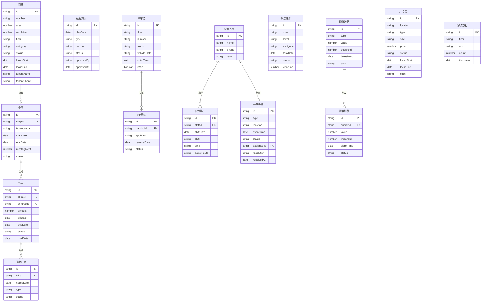

## 1. 架构设计

```mermaid
graph TB
    "前端 React + Vite" --> "状态管理 Zustand"
    "状态管理 Zustand" --> "Mock数据层"
    "前端 React + Vite" --> "路由 React Router"
    "前端 React + Vite" --> "UI组件库"
    "UI组件库" --> "Recharts 图表"
    "UI组件库" --> "TailwindCSS 样式"
    "UI组件库" --> "Lucide Icons"
    "前端 React + Vite" --> "工具层"
    "工具层" --> "日期处理 date-fns"
    "工具层" --> "Excel导出 xlsx"
```

## 2. 技术说明

- **前端框架**：React@18 + TypeScript
- **构建工具**：Vite
- **样式方案**：TailwindCSS@3
- **状态管理**：Zustand（轻量级，适合中型项目）
- **路由**：React Router@6
- **图表库**：Recharts（声明式React图表）
- **图标**：Lucide React
- **日期处理**：date-fns
- **Excel导出**：xlsx(SheetJS)
- **后端**：无后端，使用Mock数据模拟
- **数据存储**：Zustand持久化 + localStorage

## 3. 路由定义

| 路由 | 用途 |
|------|------|
| / | 总览仪表盘 |
| /shops | 商铺租赁管理 |
| /shops/:id | 商铺详情 |
| /operations | 运营方案管理 |
| /parking | 停车场管理 |
| /security | 安保排班 |
| /cleaning | 保洁排班 |
| /energy | 能耗监控 |
| /advertising | 广告位管理 |
| /statistics | 统计报表 |

## 4. 数据模型

### 4.1 数据模型定义



## 5. 项目目录结构

```
src/
├── components/          # 公共组件
│   ├── Layout/          # 布局组件(侧栏/顶栏/内容区)
│   ├── Charts/          # 图表封装组件
│   ├── StatusBadge/     # 状态标签组件
│   └── Modal/           # 弹窗组件
├── pages/               # 页面组件
│   ├── Dashboard/       # 总览仪表盘
│   ├── Shops/           # 商铺租赁管理
│   ├── Operations/      # 运营方案管理
│   ├── Parking/         # 停车场管理
│   ├── Security/        # 安保排班
│   ├── Cleaning/        # 保洁排班
│   ├── Energy/          # 能耗监控
│   ├── Advertising/     # 广告位管理
│   └── Statistics/      # 统计报表
├── stores/              # Zustand状态管理
│   ├── shopStore.ts
│   ├── parkingStore.ts
│   ├── securityStore.ts
│   ├── cleaningStore.ts
│   ├── energyStore.ts
│   ├── advertisingStore.ts
│   └── operationStore.ts
├── mock/                # Mock数据
│   ├── shops.ts
│   ├── parking.ts
│   ├── security.ts
│   ├── cleaning.ts
│   ├── energy.ts
│   ├── advertising.ts
│   └── statistics.ts
├── utils/               # 工具函数
│   ├── dateUtils.ts
│   ├── excelExport.ts
│   └── calculations.ts
├── types/               # TypeScript类型定义
│   └── index.ts
├── App.tsx
└── main.tsx
```
